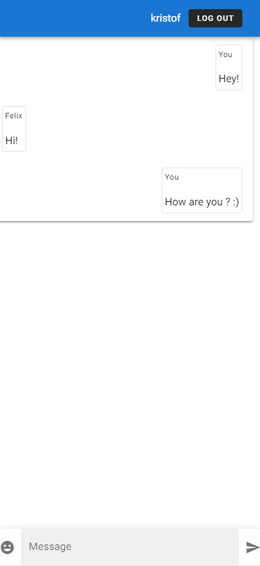

<p align="center" >
  
</p>


<p align="center">
    A very basic chat application built for a job interview within 3-4h.
</p>

## Installation 

Go to `backend` and `frontend` via
```bash
cd ${directory}
```
```bash
npm install
```

## Run the application 
Go to `backend` 
```bash
cd backend
```

```bash
npm run start
```

This starts an express server at port 3000 waiting for new messages.

Go to `frontend` 
```bash
cd backend
```

```bash
npm run serves
```
This serves the vue frontend at 8080. 


## Deploy to AWS
I simply used an EC2 instance and opened up the ports :) 